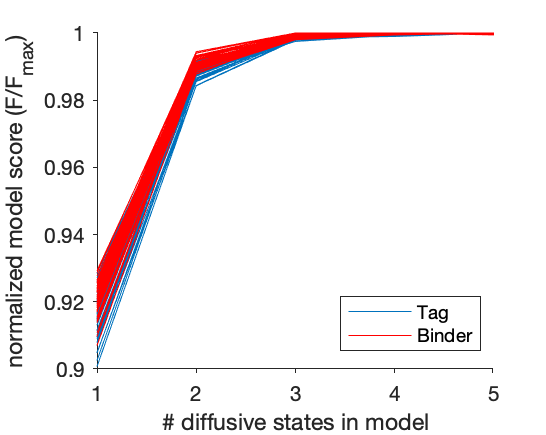

# diffusional_dynamics

This uses [variational Bayes single particle tracking](http://vbspt.sourceforge.net) (vbSPT) to annotate trajectories single particle tracks, consisting of $(x,y,t)$ coordinate data, by instantaneous diffusive state, while simultaneously classifying the diffusive behavior of the entire population of tracks with a specific number of states (we focus on 2-state models here).  

## Workflow

1. Call `generate_datasources.m`, after setting the location of your `.mat` datafiles that specify the $(x_i,y_i,t_i)$ coordinate data, and the `roi.roi` file to specify the cell ROI $(x_j,y_j)$. This will drop out tracks outside the ROI and  use the function `func_fill_missing_pos` to interpolate missing frames, then finally create data formatted for subsequent input to vbSPT.
    - Single particle tracking of tagSrc and Binder and subsequent analysis generates two files, `Exp20_EM350_1_MMStack_Pos0.ome_Left_lvPALM.mat` (Binder), and `Exp20_EM350_1_MMStack_Pos0.ome_RightCali_lvPALM.mat` (tagSrc).
        - They contain the variable `smLinked`, which contains a $M\times 17$ matrix where the first two columns correspond to $x$ and $y$ coordinates in px ($1 \text{ px} = 0.1067\text{ } \mu m$).
        - These filename and variable designations can be swapped; the key information is the $(x_i,y_i,t_i)$ data.
2. Call `generate_runinput_files.m`, which generates a vbSPT-compatible .m file for running vbSPT. This also requires defining, within the function, the location of the 'datasource' `.mat` files generated in step (1). A typical file `runinput.m` file would look as follows:

        % VB-HMM analysis parameter file generated by generate_runinput_files()
        % Mike Pablo 2018-05-02

        % Inputs
        inputfile = '../vbspt_source/bin_01.mat';
        trajectoryfield = 'vbspt_tracks';
        % Computing strategy
        parallelize_config = 1;
        parallel_start = 'theVBpool=gcp';
        parallel_end = 'delete(theVBpool)';
        % Saving options
        outputfile = './bin_01_HMManalysis_hidden2.mat';
        jobID = 'Data from bin_01.mat :: vbspt_tracks :: 180524';
        % Data properties
        timestep = 0.02;
        dim = 2;
        trjLmin = 2;
        % Convergence and computation alternatives
        runs = 25;
        maxHidden = 2;
        % Evaluate extra estimates including Viterbi paths
        stateEstimate = 1;
        maxIter = [];
        relTolF = 1e-8;
        tolPar = [];
        % Bootstrapping
        bootstrapNum = 100;
        fullBootstrap = 1;
        % Limits for initial conditions
        init_D = [0.0001,5];
        init_tD = [0.04,0.4];
        % Prior distributions
        % Diffusion constants
        prior_type_D = 'mean_strength';
        prior_D = 1;
        prior_Dstrength = 5;
        % Default prior choices (according to nat. meth. 2013 paper)
        prior_type_Pi = 'natmet13';
        prior_piStrength = 5;
        prior_type_A = 'natmet13';
        prior_tD = 10*timestep;
        prior_tDstrength = 2*prior_tD/timestep;

3. Run vbSPT using the runinput `.m` file and the datasource `.mat` files. This can reasonably done locally on a local machine (Mac with 3.4 GHz CPU with the settings prescribed above could analyze a typical cell within a tens-of-minutes-to-an-hour timescale). Large batches of data may be better managed using a compute cluster. Furthermore, models with more diffusive states (here we limit ourselves to analyzing 2-state models) will take much longer to evaluate and would best be handled on a compute cluster. See the [variational Bayes single particle tracking](http://vbspt.sourceforge.net) page for installation and setup.

## What about other higher-state models?
We found that a 2-state model was sufficient to describe our data based on the plateau of the model scores:

<b> Model scores for tagSrc (blue) and Binder (red) as a function of number of diffusive states. Each line represents an individual cell. </b> The normalized model score, $F/F_{max}$, represents a model's score divided by the maximal score for that cell across models containing 1, 2, 3, 4, or 5 diffusive states. $F$ is a bound on $\text{ln}(p(x|N))$, the probability of the data $x$ given the number of diffusive states $N$. See Eq. S7 in the vbSPT userguide (downloadable as part of the software [here](https://media.nature.com/original/nature-assets/nmeth/journal/v10/n3/extref/nmeth.2367-S2.zip)) for details.

